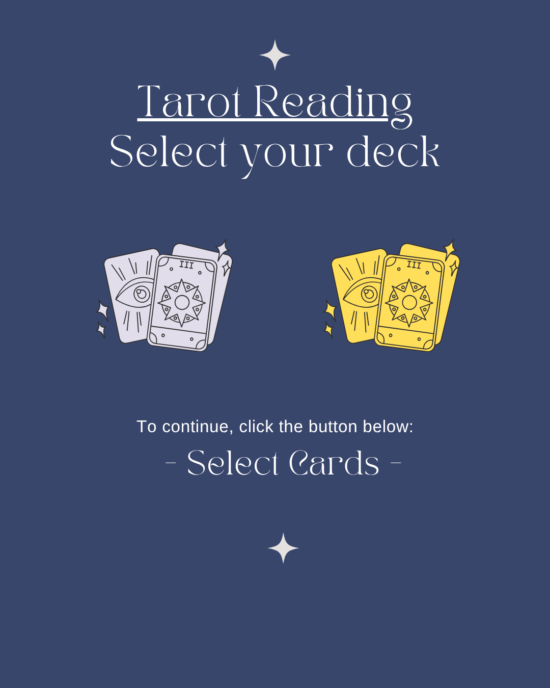
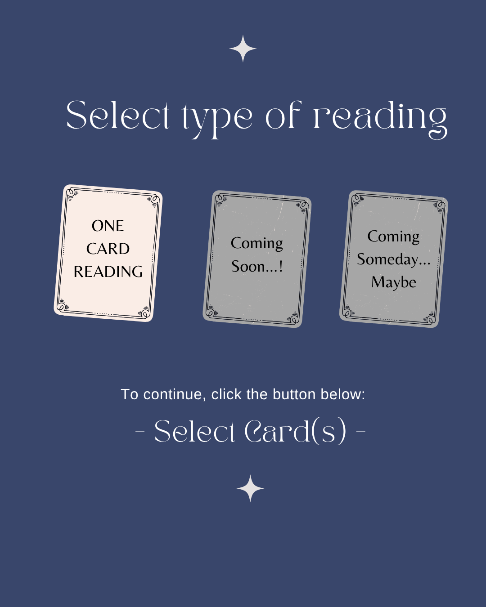
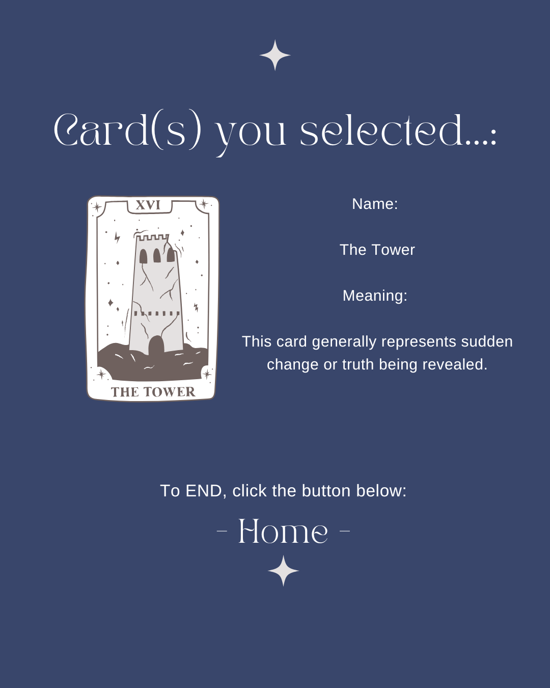

# Course Project: Project Specs
---
### URL to GitHub Repository Link

https://github.com/hummingbeeing/courseproject_front-end

---

## 1. Project Overview

The project is a tarot reading website, where users can experience an online version of selecting a random card from a spread of tarot cards. Users who wants to test their knowledge of tarot cards can also experience flash card mode.

---

## 2. User Stories

- As a fan of tarot reading who goes to tarot reading shops to get readings, I would like an alternative way to draw a random tarot cards for a quick reading instead of having to visit a shop every time.

- As someone who wants to learn how to do tarot readings, I would like a flash card of tarot cards to learn to match the image to the meanings.

---

## 3. Application Features

- When a user selects a deck and a mode of reading, the app will generate a random spread of cards from which the user can select a random tarot card that is face down. Proceeding to reveal the card will show the card and the associated meaning.

- When a user selects flash card mode, the app will show an image of the card that is randomly generated. Clicking on the image will reveal the card meaning.

---

## 4. FRAMEWORKS, APIs, and DATA

### Tarot Card APIs

https://www.kaggle.com/datasets/lsind18/tarot-json
https://github.com/krates98/tarotcardapi
https://github.com/sheoak/tarot-deck

---

## 5. Mock Up

Flow: 
Home Page → Select Mode: Tarot Reading or Flash Card

Tarot Reading: Select Deck → Select type of reading → Select card based on type of reading → Reveal selected cards → Return Home

Flash Card: Front of Card → Back of Card → Next Card or Home

---
- ### Page 1: Home Page
    
    

---
- ### Page 2: Choose between two features: Tarot Reading or Flash Cards

    

---
- ### Page 3: Tarot Reading: Select Deck

    

---
- ### Page 4: Select type of reading
    
    

---
- ### Page 5: Select card based on type of reading

    

---
- ### Page 6: Reveal selected cards → Return Home

    

---
- ### Page 7: Flash Card Front
    
    

---
- ### Page 8: Flash Card Back
    
    

